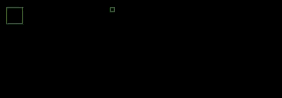

# SPH.lua

Lua physics handling library for axis-aligned bounding boxes. It was made for simple and fast prototyping in personal use and even simple game creations. It was made based on [this towerfall developer's post](https://maddythorson.medium.com/celeste-and-towerfall-physics-d24bd2ae0fc5). This library was created on top of the LÖVE framework, so the examples will be based on it.

It automagically handle collisions and callbacks for objects overlapping accordingly to your needs.

## Example

```lua
local sph = require 'sph'

function love.load()
  player = sph.newActor(64, 32, 32, 32, { 'player' })
  collectible = sph.newActor(256, 32, 8, 8, { 'collectible'})
  collected = false -- just to stop moving the 'player' after the collision trigger
end

function handleCollision(collider)
  if (collider.tags[2] == 'collectible') then -- I'm doing this hardcoded but on a real life project you'll not do that
    print('collect the item')
    collider:destroy()
    collected = true
  end
end

function love.update()
  if (not collected) then
    player:setLinearVelocity({ x = 3 }, handleCollision)
  end
end

function love.draw()
  sph.draw(0.5) -- here we draw every collision shape with an alpha of 50%
end
```

Running the snippet the result will be:



And in your console you should see `collect the item` printed.
As the reference post I linked above, it also handles Actor squish by default as destroying it. It's a separated function from `destroy` so you can override it as you want.

## API

```lua
actor = sph.newActor(x, y, width, height, tags = { 'projectile', 'hitbox' }) -- default tag[1] = 'actor'
solid = sph.newSolid(x, y, width, height, tags = { 'elevator' }) -- default tag[1] = 'solid'

actor:setLinearVelocity(vector = { x = 1, y = 2 }, onCollide)
--[[ moves the actor
onCollide will be called when collided with both solids and actors, returning the trigger (for actors) or collider object ]]--

actor:destroy() -- destroys the actor
solid:setLinearVelocity(x, y) -- moves the solid, but instead of receiving a vector table, x and y are received as separated parameters

sph.draw(alpha) -- draws every SPH object on screen with the desired alpha (0 - 1)
```
